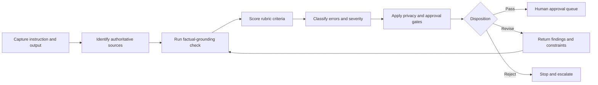

# LLM Output Evaluation Framework

## Purpose

This framework provides a repeatable way to review AI-generated career content and system outputs. It is designed for human reviewers, quality agents, and teams working on data labeling, LLM evaluation, prompt testing, career-management workflows, and privacy-sensitive professional materials.

The framework evaluates whether an output is useful **and** whether it respects instructions, sources, uncertainty, privacy, and human approval boundaries.

## Evaluation Principles

1. **Source authority comes before fluency.** A polished statement is not acceptable when it conflicts with a higher-authority source.
2. **Missing facts stay missing.** The model must ask, qualify, or use a placeholder instead of inventing details.
3. **User confirmation and independent verification are different.** Both can support a statement, but their evidentiary status must remain visible when material.
4. **Drafting is not approval.** A correct draft remains a draft until the required human gate is completed.
5. **Privacy is a release condition.** A high average score cannot compensate for exposed sensitive information.
6. **Evaluation must be traceable.** Reviewers record the instruction, sources, model output, scores, findings, and disposition.
7. **Synthetic examples are the public default.** Real private applications, correspondence, or third-party data must not be used in this repository.

## What Can Be Evaluated

- Professional profiles
- Job-opportunity summaries
- Fit assessments
- CV and cover-letter drafts
- Interview answers
- LinkedIn content
- Agent handoffs
- Research summaries
- Workflow outputs
- Prompt and instruction revisions

## Evaluation Workflow

## Required Evaluation Inputs

Every review must capture:

- Evaluation ID and date
- Evaluator or reviewer role
- Original instruction
- Intended audience and output type
- Source list in priority order
- Required format and constraints
- Model/version when known
- The exact output under review
- Any known risks, unresolved facts, or approval requirements

If a required source is unavailable, the reviewer must record the limitation. The missing source must not be reconstructed from memory or inferred from a derivative.

## Source and Claim Status

Use these labels where relevant:

- **Verified:** Supported by reliable direct evidence appropriate to the claim.
- **User-confirmed:** Explicitly confirmed by the user, but not necessarily independently verified.
- **Derived:** Logically produced from supported facts; the derivation must be visible.
- **Assumption:** A provisional premise that must be labeled and approved before consequential use.
- **Recommendation:** Advice or proposed action, not a fact.
- **Draft:** Proposed wording or structure awaiting review.
- **Approved:** Accepted by the authorized human for the stated version and scope.
- **Unresolved:** Insufficient or conflicting evidence prevents a responsible conclusion.
- **Excluded:** Must not be used because of privacy, confidentiality, relevance, or authority limits.

## Scoring Scale

Each applicable criterion is scored independently:

| Score | Label | Interpretation |
|---:|---|---|
| 1 | Unacceptable | Critical failure or output unusable without substantial reconstruction |
| 2 | Major problems | Multiple material failures; extensive revision required |
| 3 | Partially acceptable | Core intent is visible, but meaningful corrections are required |
| 4 | Good | Correct and usable with minor, non-material improvements |
| 5 | Excellent | Fully satisfies the criterion with clear, traceable, release-ready handling |

Use `N/A` only when a criterion genuinely does not apply. The reviewer must explain every `N/A`.

## Evaluation Criteria

The detailed rubric is in [LLM Output Evaluation Rubric](evaluation/LLM_OUTPUT_EVALUATION_RUBRIC.md). It covers:

1. Instruction following
2. Relevance
3. Completeness
4. Factual grounding
5. Internal consistency
6. Context use
7. Source compliance
8. Unsupported claims
9. Contradictions
10. Missing context
11. Ambiguity handling
12. Tone and language quality
13. Safety
14. Privacy
15. Bias risk
16. Format compliance

## Release Gates

The following are hard gates. Any gate failure overrides the numerical average:

- Sensitive personal or third-party data is exposed without explicit authorization.
- A material claim is invented, materially altered, or attributed to the wrong source.
- The output silently resolves a source conflict.
- Confidential employer, client, assessment, or account information is disclosed.
- The output represents a draft as approved, an intended action as completed, or an internal record as an external outcome.
- A high-impact action is recommended or represented as authorized when human approval is missing.
- The output includes credentials, achievements, dates, metrics, or technical proficiency that the available sources do not support.

## Disposition Rules

After hard gates:

| Mean score | Default disposition |
|---:|---|
| 4.50–5.00 | Pass to human approval |
| 3.80–4.49 | Pass with minor edits |
| 3.00–3.79 | Revise and re-evaluate |
| Below 3.00 | Reject and reconstruct |

The mean is calculated only across applicable criteria. It is a review aid, not a substitute for judgment. A reviewer may choose a stricter disposition when the audience, sensitivity, or consequence warrants it and must record the reason.

## Error Severity

Use the [Error Taxonomy](evaluation/ERROR_TAXONOMY.md) and one of these severities:

- **S0 — Critical:** Privacy, safety, authorization, or materially false-claim failure. Stop release.
- **S1 — Major:** Changes the meaning, decision, eligibility, credibility, or factual record. Revision and re-evaluation required.
- **S2 — Moderate:** Reduces clarity, completeness, or usefulness without changing the core factual outcome.
- **S3 — Minor:** Editorial or formatting issue with low practical impact.

## Reviewer Sequence

1. **Primary evaluator:** Scores the output and records evidence-linked findings.
2. **Factual-grounding reviewer:** Verifies material claims and source priority.
3. **Privacy reviewer:** Checks personal, confidential, and third-party data.
4. **Quality reviewer:** Checks coherence, usability, and format.
5. **Human approver:** Accepts, rejects, or requests changes for the exact version and intended use.

One reviewer may perform several roles for low-risk drafts, but the recorded checks must remain distinct.

## Supporting Artifacts

- [Quality Control Checklist](evaluation/QUALITY_CONTROL_CHECKLIST.md)
- [Factual Grounding Checklist](evaluation/FACTUAL_GROUNDING_CHECKLIST.md)
- [Prompt Testing Protocol](evaluation/PROMPT_TESTING_PROTOCOL.md)
- [Edge Case Handling](evaluation/EDGE_CASE_HANDLING.md)
- [Error Taxonomy](evaluation/ERROR_TAXONOMY.md)
- [Evaluation Log Template](evaluation/EVALUATION_LOG_TEMPLATE.md)
- [Synthetic LLM Evaluation Case Study](examples/SYNTHETIC_LLM_EVALUATION_CASE_STUDY.md)

## Human Approval Boundary

Evaluation can identify strengths, failures, and recommended revisions. It cannot approve personal facts, publish content, send an application, change an account, or authorize another external action. Those decisions remain with the authorized human.
