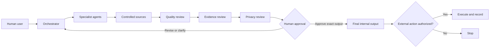

# AI Career OS

> **A Privacy-Aware Multi-Agent Career Management System**

AI Career OS is a reusable, documentation-first system for organizing professional facts, career decisions, job research, application materials, interview preparation, portfolio work, and AI-assisted quality review.

It is designed for any job seeker, regardless of country, profession, language, education, or career stage.

## Project Status

**Local release candidate — publication pending.**

The repository contains architecture documents, agent specifications, workflows, templates, evaluation tools, and fully synthetic examples. It is not a deployed agent service or an automated job-application platform.

The repository deliberately contains no maintainer CV, employment history, languages, education, certifications, location, contact details, account data, or private career records.

## The Problem

Career information is often scattered across CVs, notes, job boards, messages, and AI conversations. This can cause:

- conflicting facts and dates;
- unsupported claims;
- duplicated or outdated material;
- unclear approval status;
- accidental disclosure of private information; and
- external actions without a deliberate human decision.

AI Career OS provides one structure for controlling those risks.

## What the System Does

- Maintains a verified professional profile as the source for career facts
- Separates facts, decisions, assumptions, recommendations, drafts, actions, and outcomes
- Routes tasks through specialist and reviewer roles
- Stops when information is missing, conflicting, sensitive, or consequential
- Requires human approval before publication, submission, messaging, or account changes
- Evaluates AI outputs against explicit quality and grounding criteria
- Provides reusable templates that adopters complete with their own information

## Five-Minute Tour

If you are reviewing the project quickly, open these files:

1. [Project Overview](PROJECT_OVERVIEW.md) — purpose and boundaries
2. [System Architecture](SYSTEM_ARCHITECTURE.md) — components and control flow
3. [Agent Roles](AGENT_ROLES.md) — responsibility model
4. [Source Governance](SOURCE_GOVERNANCE.md) — fact and state control
5. [Evaluation Framework](EVALUATION_FRAMEWORK.md) — LLM quality methodology
6. [Synthetic Evaluation Case](examples/SYNTHETIC_LLM_EVALUATION_CASE_STUDY.md) — worked example

## How to Adopt It

1. Fork or copy the repository.
2. Keep real career data in a private working copy.
3. Complete the [Reusable Professional Profile Starter](PUBLIC_PROFESSIONAL_PROFILE.md).
4. Define career goals with the templates in [`templates/`](templates/PROFESSIONAL_PROFILE_TEMPLATE.md).
5. Use the relevant workflow for each task.
6. Review outputs with the quality, evidence, and privacy checks.
7. Approve every external action separately.

Do not put secrets, identity documents, private applications, confidential employer information, or raw personal evidence in a public fork.

## Reference Architecture

The Orchestrator routes work. It does not own professional facts, approve claims, or authorize external actions.

## Agent Groups

| Group | Responsibility |
|---|---|
| Orchestrator | Scope tasks, select sources, route work, and enforce stop conditions |
| Profile and strategy agents | Maintain fact boundaries, goals, and decision context |
| Research and assessment agents | Gather evidence and compare opportunities |
| Material agents | Draft CV, interview, LinkedIn, and portfolio content |
| Review agents | Check quality, evidence, contradictions, and privacy |
| Human user | Approve facts, decisions, final content, and external actions |

Each role has a complete operating contract in [`agents/`](agents/ORCHESTRATOR_AGENT.md).

## Source and State Model

Each material record separates four dimensions:

| Dimension | Question |
|---|---|
| Evidence | How well is the information supported? |
| Decision | Has a human adopted the choice? |
| Document | Is this exact version still a draft or approved content? |
| Execution | Has an external action been authorized or completed? |

`FACT`, `DECISION`, `ASSUMPTION`, and `RECOMMENDATION` describe information types. They do not replace the four states above.

See [Source Governance](SOURCE_GOVERNANCE.md).

## LLM Evaluation

AI-assisted outputs are evaluated on a 1–5 scale across 16 criteria, including:

- instruction following;
- relevance and completeness;
- factual grounding and source compliance;
- contradiction and ambiguity handling;
- unsupported claims and missing context;
- privacy, safety, tone, and format.

Critical privacy, authorization, safety, or factual-grounding failures cannot be averaged away by strong writing.

See the [Evaluation Framework](EVALUATION_FRAMEWORK.md), [full rubric](evaluation/LLM_OUTPUT_EVALUATION_RUBRIC.md), and [synthetic case study](examples/SYNTHETIC_LLM_EVALUATION_CASE_STUDY.md).

## Privacy by Design

- Public examples are fictional and marked synthetic.
- Templates contain placeholders, not real user data.
- Private evidence stays outside public repositories.
- Minimum-necessary information is preferred.
- Content approval is separate from authorization to send or publish.
- A contextual privacy review is required before release.

See [Privacy and Data Governance](PRIVACY_AND_DATA_GOVERNANCE.md) and [Security](SECURITY.md).

## Repository Map

| Area | Contents |
|---|---|
| Root documents | Architecture, governance, lifecycle, evaluation, privacy, and limitations |
| [`agents/`](agents/ORCHESTRATOR_AGENT.md) | Orchestrator, specialist, and reviewer contracts |
| [`workflows/`](workflows/PROFESSIONAL_PROFILE_WORKFLOW.md) | End-to-end career workflows |
| [`templates/`](templates/PROFESSIONAL_PROFILE_TEMPLATE.md) | Blank reusable working records |
| [`evaluation/`](evaluation/LLM_OUTPUT_EVALUATION_RUBRIC.md) | Rubrics, checklists, error taxonomy, and testing protocol |
| [`examples/`](examples/SYNTHETIC_PROFESSIONAL_PROFILE.md) | Fictional demonstrations only |
| [`linkedin/`](linkedin/LINKEDIN_PROFILE_AUDIT.md) | LinkedIn review and drafting workflows |

## Responsible Use

This system supports structured thinking and review. It does not make hiring decisions, guarantee employment, provide legal advice, validate claims automatically, or remove the need for human judgment.

See [Limitations](LIMITATIONS.md).

## Development and Attribution

The repository uses a human-directed, AI-assisted development model. Contribution claims should match actual work and public Git history. See [Project Development and Attribution](AUTHOR_CONTRIBUTION.md).

## License

This repository is licensed under the [MIT License](LICENSE). It may be reused, modified, and shared under that license. Adopters remain responsible for removing personal or third-party material they do not have the right to publish.
