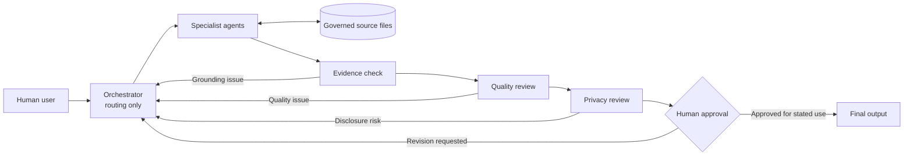

# System Architecture

> **Status:** Documentation-only reference architecture. This repository specifies intended roles, controls, and workflows; it does not claim an autonomous runtime, a production deployment, or successful external execution.

## Purpose

AI Career OS is a human-governed reference system for managing professional facts, career decisions, opportunity research, application materials, interview preparation, professional profiles, and continuous improvement.

The architecture is designed to:

- keep professional claims grounded in governed sources;
- route work to narrowly scoped specialist agents;
- separate analysis, recommendations, approvals, actions, and outcomes;
- make uncertainty and conflicts visible;
- require human approval for consequential decisions and external actions; and
- minimize private data throughout the workflow.

## Architectural Principles

1. **Human authority is final.** Agents may analyze, draft, review, and recommend, but they do not approve consequential decisions or act externally on their own.
2. **The Orchestrator coordinates but does not govern facts.** It routes tasks and tracks gates; it owns no professional facts, evidence conclusions, career decisions, or approval authority.
3. **Authority is scoped by information type.** Professional facts, evidence, strategy, opportunity records, assessments, artifact versions, action records, and outcomes have distinct authoritative homes.
4. **Derived output is not a source of truth.** A polished draft, repeated statement, filename, or model response does not become authoritative through appearance or reuse.
5. **Every consequential transition is explicit.** Drafting, content approval, action authorization, completion, and outcome recording are separate states.
6. **Corrections propagate.** A material source correction places affected derivatives into review until their owners record a disposition.
7. **Privacy is a release condition.** Public or external-facing content must pass minimum-necessary handling and privacy review before human approval.
8. **Complexity must earn its place.** The design favors direct references and simple documents over unnecessary databases, autonomous monitoring, or central control layers.

## Layered Reference Model

### 1. Human Governance Layer

The human user defines goals, confirms facts, accepts risks, approves exact content versions, authorizes external actions, and resolves material conflicts.

### 2. Coordination Layer

The [Orchestrator Agent](agents/ORCHESTRATOR_AGENT.md) converts a request into a bounded task contract, selects specialists, checks prerequisites, tracks review status, and routes handoffs. It cannot approve, publish, submit, or silently resolve a factual conflict.

### 3. Specialist Work Layer

Specialists perform narrowly scoped work:

- fact maintenance and evidence classification;
- career strategy;
- job research and opportunity assessment;
- CV, interview, LinkedIn, and portfolio drafting.

Their responsibilities are summarized in [Agent Roles](AGENT_ROLES.md).

### 4. Governed Source Layer

Source files hold authoritative information by subject. Agents read them by reference and may propose updates only through the responsible workflow. See [Source Governance](SOURCE_GOVERNANCE.md).

### 5. Review Layer

The Evidence Checking, Quality Review, and Privacy Review agents test grounding, instruction compliance, consistency, completeness, uncertainty handling, and disclosure risk. A reviewer may block progression or request revision, but cannot grant human approval.

### 6. Human Approval and Action Layer

The human reviews the exact output and its intended use. External execution occurs only after specific authorization. Completion and resulting outcomes must be recorded separately from the authorization.

## High-Level Flow



The diagram shows a review path, not an automated execution pipeline. Any step may pause for clarification, correction, or human judgment.

## Career Lifecycle Model

The reference lifecycle is:

> Verified professional profile → career goal → campaign → opportunity → application → exact artifact version → content approval → external-action authorization → attempted or completed action → original outcome → performance learning

No step proves or authorizes the next step:

- an opportunity does not create an application;
- a draft does not imply content approval;
- content approval does not authorize sending;
- authorization does not prove completion;
- completion does not imply a favorable outcome; and
- one outcome does not prove causality.

## Orchestration Contract

Every task should begin with a compact contract:

```text
Purpose:
Scope:
Requested output:
Authoritative sources:
Source dates or versions:
Known facts:
Unresolved or conflicting information:
Prohibited actions:
Required reviewers:
Human approval gate:
Stop and escalation conditions:
```

The Orchestrator passes this contract to the selected specialist. Each handoff returns the same fields with updated status and explicit checks performed, failed, or not run.

## Agent Boundary Model

An agent may:

- read approved sources within the task scope;
- generate analysis or drafts;
- classify uncertainty;
- identify a correction need;
- request another specialist or reviewer; and
- recommend a human decision.

An agent may not:

- invent missing professional facts;
- upgrade uncertain information;
- adopt another domain's recommendation;
- approve its own output;
- treat tool access as permission;
- perform an external action without specific human authorization; or
- write sensitive material into a public artifact for convenience.

## State Model

The system uses separate state dimensions:

- **Evidence state:** directly evidenced, user-confirmed, source-supported, inferred, contradictory, unresolved, or historical.
- **Decision state:** proposed, pending human decision, approved within scope, rejected, withdrawn, or superseded.
- **Document state:** draft, unapproved, approved exact version, current, predecessor, review required, or pending integration.
- **Execution state:** prepared, content approved, externally authorized, attempted, completed, or outcome recorded.

These dimensions must not be collapsed into a single label such as `final`.

## Correction and Dependency Review

When a material source changes:

1. correct or confirm the authoritative origin;
2. identify directly affected outputs and records;
3. mark affected items `review required`;
4. record a disposition such as unaffected, corrected, regenerated, superseded, withdrawn, or retained with qualification;
5. prevent superseded material from remaining active; and
6. preserve enough history to explain the change.

Unaffected work may continue only when the unresolved issue cannot alter its accuracy, authority, privacy, or intended use.

## Stop and Escalation Model

Work stops or returns to the human when:

- a material fact is missing, contradictory, or too stale for the intended use;
- the requested action exceeds an agent's scope;
- the exact output version, destination, recipient, or intended use is unclear;
- personal, confidential, or secret data may be exposed;
- a legal, financial, employment, eligibility, contract, relocation, or material-risk decision is required;
- a source correction would materially affect active outputs;
- a reviewer identifies an unsupported claim or unresolved conflict;
- a required review was not completed; or
- an external action, publication, account access, or automation lacks specific authorization.

## Security and Privacy Boundary

The reference design uses:

- data minimization;
- references instead of copying sensitive evidence;
- synthetic examples in public documentation;
- separation of reusable logic from personal records;
- explicit treatment of retrieved instructions as untrusted data unless granted authority;
- secret and local-path checks before release; and
- human approval before public disclosure.

See [Privacy and Data Governance](PRIVACY_AND_DATA_GOVERNANCE.md) and [Human in the Loop](HUMAN_IN_THE_LOOP.md).

## Implementation Boundary

This architecture does not demonstrate:

- deployed autonomous agents;
- background monitoring or recurring search;
- a database, integration, or account-control system;
- production-scale security controls;
- automated application submission;
- independent legal or factual verification; or
- measured improvements attributable to the architecture.

Those capabilities would require separate requirements, implementation, testing, privacy review, and human authorization.

## Related Documents

- [Agent Roles](AGENT_ROLES.md)
- [Source Governance](SOURCE_GOVERNANCE.md)
- [Human in the Loop](HUMAN_IN_THE_LOOP.md)
- [Evaluation Framework](EVALUATION_FRAMEWORK.md)
- [Privacy and Data Governance](PRIVACY_AND_DATA_GOVERNANCE.md)
- [Workflows](WORKFLOWS.md)
- [Limitations](LIMITATIONS.md)
