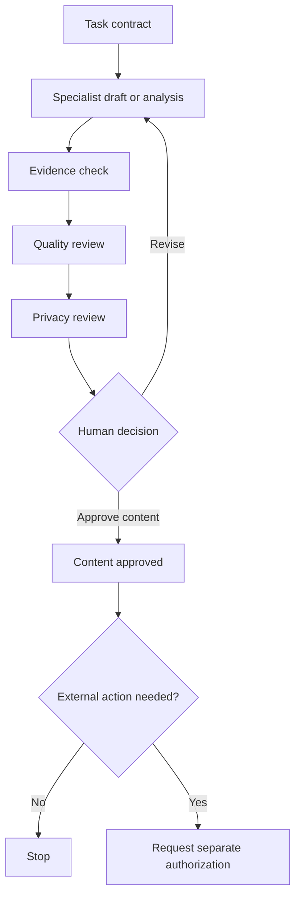

# Workflow Index

Each workflow starts with a task contract and ends at a named stopping point. The Orchestrator may route work, but the responsible source and human approval gate remain unchanged.

## Common task contract

Before work begins, record:

- the requested outcome;
- what is in and out of scope;
- the authoritative sources;
- the currentness requirement;
- the allowed tools and data;
- the required reviewers;
- the human approval point; and
- the stop and escalation conditions.

## Template shorthand and governance states

Some workflows and templates use compact type tags. They do not replace the full states in [Source Governance](SOURCE_GOVERNANCE.md):

| Compact tag | Required full treatment |
|---|---|
| `FACT` | Add an evidence state such as directly evidenced, user-confirmed, source-supported, contradictory, or unresolved |
| `DECISION` | Add a decision state such as proposed, pending human decision, or approved within stated scope |
| `ASSUMPTION` | Treat as inference; never convert it into an external claim without resolution |
| `RECOMMENDATION` | Keep advisory and separate from the human decision |

`DRAFT` and `APPROVED` are not information types. Use `Draft` only as a Document state. Replace any unqualified approval label with the exact applicable state: `Approved within stated scope`, `Approved exact version`, `Content approved`, or `Externally authorized`.

## Workflow directory

| Workflow | Use it when | Primary output |
|---|---|---|
| [Professional Profile](workflows/PROFESSIONAL_PROFILE_WORKFLOW.md) | Establishing or correcting facts | Verified profile draft and unresolved queue |
| [Career Goal](workflows/CAREER_GOAL_WORKFLOW.md) | Defining direction and priorities | User-approved goal record |
| [Job Discovery](workflows/JOB_DISCOVERY_WORKFLOW.md) | Finding current roles | Evidence-backed opportunity candidates |
| [Opportunity Assessment](workflows/OPPORTUNITY_ASSESSMENT_WORKFLOW.md) | Comparing a role with the profile | Fit, gaps, risks, and recommendation |
| [CV Tailoring](workflows/CV_TAILORING_WORKFLOW.md) | Preparing a targeted CV | Versioned, reviewed CV draft |
| [Application](workflows/APPLICATION_WORKFLOW.md) | Managing an actual application | Separate content, authorization, action, and outcome records |
| [Interview Preparation](workflows/INTERVIEW_PREPARATION_WORKFLOW.md) | Preparing truthful answers and questions | Evidence-linked interview pack |
| [LinkedIn Optimization](workflows/LINKEDIN_OPTIMIZATION_WORKFLOW.md) | Improving one profile section | Reviewed section draft |
| [Portfolio Development](workflows/PORTFOLIO_DEVELOPMENT_WORKFLOW.md) | Creating a public project record | Privacy-reviewed portfolio artifact |
| [Offer Evaluation](workflows/OFFER_EVALUATION_WORKFLOW.md) | Comparing an offer with goals and constraints | Decision brief, not a decision |
| [Onboarding](workflows/ONBOARDING_WORKFLOW.md) | Planning an accepted transition | Onboarding plan with a recorded human decision state |
| [Quarterly Review](workflows/QUARTERLY_CAREER_REVIEW_WORKFLOW.md) | Reviewing progress and evidence | Findings, proposals, and scoped human decisions |

## Standard review chain

## Universal stop conditions

Stop and escalate when:

- a material fact is missing or contradictory;
- the authoritative source is unclear or stale;
- a draft would increase the certainty or scope of a claim;
- personal, employer, client, or third-party data exceeds the minimum need;
- the requested action is outside the approved task contract;
- an external action lacks exact authorization; or
- a reviewer identifies a critical factual, privacy, safety, or authorization failure.

Use [Source Governance](SOURCE_GOVERNANCE.md), [Human in the Loop](HUMAN_IN_THE_LOOP.md), and the [Quality Control Checklist](evaluation/QUALITY_CONTROL_CHECKLIST.md) with every consequential workflow.
